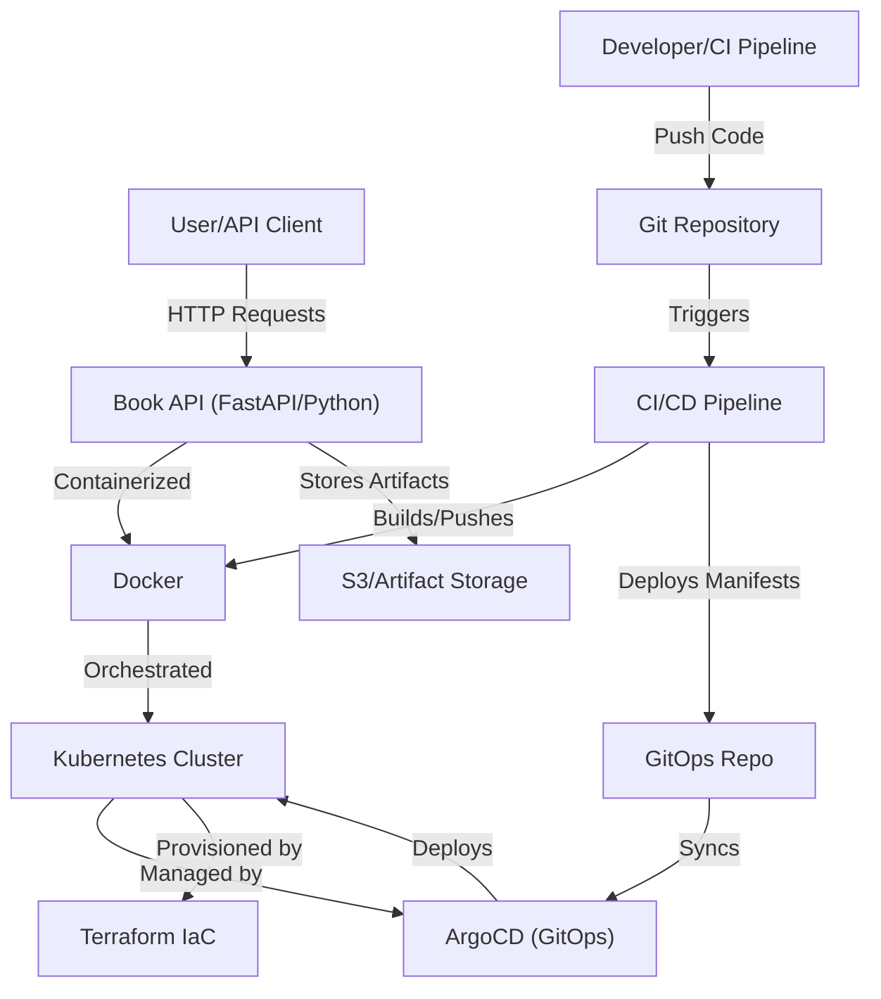

# Architecture

## Overview

This project implements a cloud-native Book API platform with a modern DevOps toolchain. The architecture leverages containerization, orchestration, infrastructure-as-code, and automated CI/CD for scalable, reliable, and maintainable deployments.

## Architecture Diagram

## Highlights

- Microservices-based Book API built with Python
- Containerized using Docker for consistent deployments
- Kubernetes orchestrates scalable, resilient workloads
- Infrastructure managed as code with Terraform
- Automated CI/CD pipelines for build, test, and deployment
- ArgoCD enables GitOps-driven, declarative deployments
- Secure configuration and environment management
- Zero-downtime rolling updates and rollback support
- Modular design for easy extensibility and maintenance
